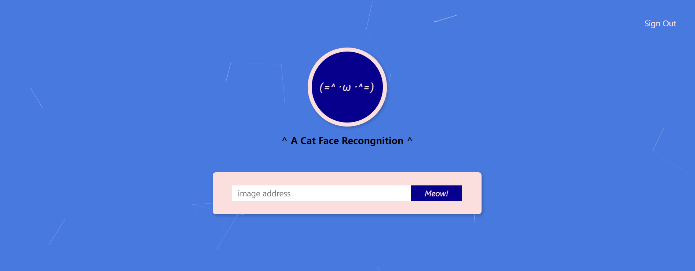

# Cat-fe


> ## A web app recognizing cat faces by inputting the address of cat photos
<br>



## Table of Contents

- [Features](#features)
- [Learning_Objects](#learning_objects)
- [Setup](#setup)
- [Maintainers](#maintainers)
- [Contributing](#contributing)
- [License](#license)

## Features

* [Cat-fe Link](https://rathru3704.github.io/React_doppelganger/)

* Fetch JSON data from
    * https://randomuser.me
    * https://jsonplaceholder.typicode.com/

* Provide a seach box to search user names.

* Style the interface by utilizing Tachyons.

## Learning_Objects

* Deploy the front-end and RESTful API server connecting with database on Paas (Heroku).

* Create client-side and server-side validation for layers of security.

* Encrypt user password using hash algorithm.

## Setup

* This project uses [node](http://nodejs.org) and [npm](https://npmjs.com). Please ensure you have them locally installed.

* Open Git Bash, change the current working directory and type `git clone` syntax:

    ```sh
    $ git clone https://github.com/Rathru3704/React_Express_PostgreSQL_cat-fe.git
    ```

* Use `npm install` to get all dependencies downloaded and start to run the app:

    ```sh
    $ npm install
    $ npm run start
    ```

## Maintainers

[@Rathru3704](https://github.com/Rathru3704)

## Contributing

Please contribute! [Look at the issues](https://github.com/Rathru3704/React_Express_PostgreSQL_cat-fe/issues)<br />
PRs accepted.

## License

[MIT](LICENSE) © Arthur Chang